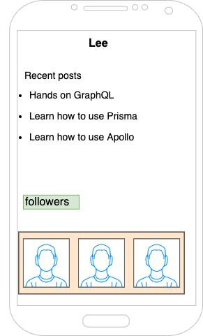
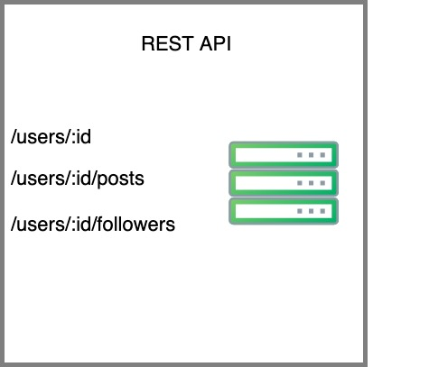
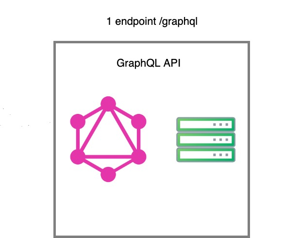

Hands on GraphQL

---

## AGENDA

@ol
- Introduction to Graphql
- Demo: GraphQL twitter API 
- GraphQL Basics:
  - Schema
  - Query / Practice
  - Mutation / Practice
  - Subscription / Practice
- Possible GraphQL API Architectures 
- Learn by doing: GraphQL over REST 
@ulend
  
---
@snap[north span-100]
### What is *GraphQL*?
@snapend

@ul
- A new open source API standard (invented and released by facebook in 2015)
- A **query language** for API
- Enables **declarative** data fetching
@ulend

---

@snap[north span-100]
### The year 2000 when REST was developed
@snapend

@ul
- Mobile development still in its enfacy.
- Client side application was fairly simple.
- Application development speed does not compare to 2015.
@ulend

---

@snap[north span-100]
### Why GraphQL?
@snapend

@ul
- Increased mobile usage created the need for efficient data loading.
- Variatey of plateforms on the client side: Phone, Tablet, Smart watch, etc.
- Fast development speed and expectation for rapid feature development.
@ulend

---

#### Data fetching with REST Vs GraphQL

---
@snap[north span-100]
### A blogging app with a REST API

@snapend

---
@snap[north span-100]
### A blogging app with a REST API

@snapend

---?image=assets/blog-app.png&size=auto 50%
---?image=assets/blog-app-1.png&size=auto 50%
---?image=assets/blog-app-2.jpg&size=auto 50%
---?image=assets/blog-app-3.png&size=auto 50%
---?image=assets/blog-app-4.jpg&size=auto 50%
---?image=assets/blog-app-5.png&size=auto 50%
---?image=assets/blog-app-6.jpg&size=auto 50%

---
@snap[north span-100]
### A blogging app with a GraphQL API

@snapend

---?image=assets/blog-app-gql.jpg&size=auto 85%
---?image=assets/blog-app-gql-1.jpg&size=auto 95%
---?image=assets/blog-app-gql-2.jpg&size=auto 100%
